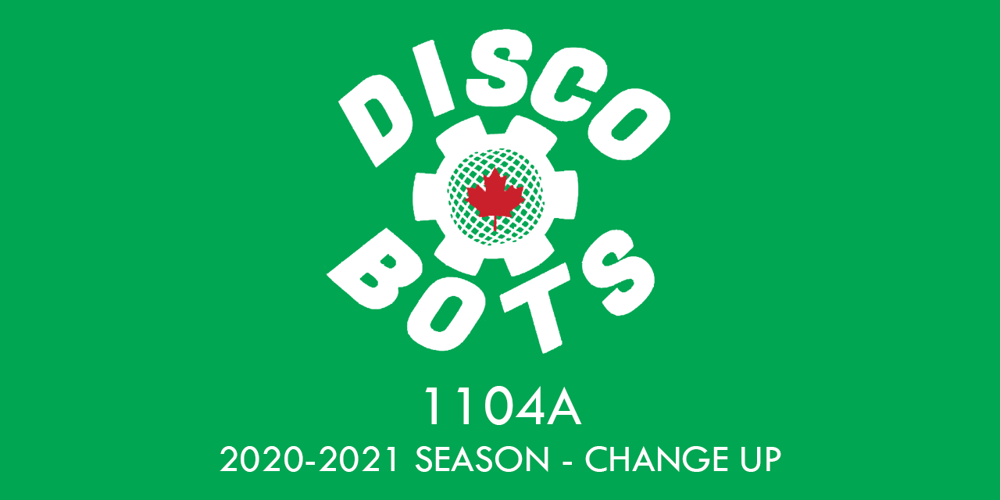

<p align="center">
  <a href="https://www.youtube.com/watch?v=8_ZCXUnsZbk">
    
  </a>

  <h1 align="center">2020-2021-bionic-beaver</h1>
  <h4 align="center"><i>Discobots</i> <b>1104A's</b> code for the VEX VRC 2020-2021 Season—Change Up</h4>
  
  <p align="center">
    <a href="https://github.com/Discobots-1104A/2020-2021-bionic-beaver/graphs/contributors">
      
    </a>
    <a href="https://github.com/Discobots-1104A/2020-2021-bionic-beaver/commits">
      
    </a>
    <a href="https://github.com/Discobots-1104A/2020-2021-bionic-beaver/blob/master/LICENSE">
      
    </a>
    <a href="https://www.codacy.com/gh/Discobots-1104A/2020-2021-bionic-beaver/dashboard?utm_source=github.com&amp;utm_medium=referral&amp;utm_content=Discobots-1104A/2020-2021-bionic-beaver&amp;utm_campaign=Badge_Grade"></a>
    <br>
    <a href="mailto:1104a@bramptonrobotics.org">
      
    </a>
    <a href="https://www.bramptonrobotics.org">
      
    </a>
  </p>
</p>

<br>

## Table of Contents

* [About the Project](#about-the-project)
  * [Built With](#built-with)
* [Getting Started](#getting-started)
  * [Prerequisites](#prerequisites)
  * [Cloning](#cloning)
  * [Building and Uploading](#building-and-uploading)
* [Contributing](#contributing)
* [License](#license)
* [Contact](#contact)
  * [Sponsorships](#sponsorships)
* [Acknowledgements](#acknowledgements)
  * [Sponsors](#sponsors)

## About the Project

This is *Discobots* **1104A's** source code for this year's VEX VRC season. We have decided to make this repository public for educational purposes for other teams\*, as well for archival purposes.  

We primarily use C++ for our program. However, we do interface with some of the C functions within PROS (mainly for our subsystem wrapper classes).  

If you wish to take a look at older versions of our code, please check out our branches\*\*.  

**We are aware code can technically be used as scouting information. However, we believe there is a valuable learning experience to be gained from looking at other teams' source code.*  
*\*\*We are also aware that the way we're using branches is an objectively messy workflow. However, for the sake of archival purposes, we're leaving it like that.*

### Built With

- [PROS](https://github.com/purduesigbots/pros/releases/tag/3.3.1)

## Getting Started

### Prerequisites

- Make sure you have the **latest version of PROS** installed. 
  - Installation methods will vary depending on platform. 
  - Take a look [here](https://pros.cs.purdue.edu/v5/getting-started/installation.html) for installation information regarding your platform.
- **OPTIONAL:** PROS Atom plugin. This is useful for those starting out with using PROS. We personally just use Visual Studio Code and the PROS CLI, but it's up to you on how you want to do it.
  - Installation methods vary depending on platform.
  - Take a look [here](https://pros.cs.purdue.edu/v5/getting-started/installation.html) for installation information regarding your platform.

### Cloning

The method does not matter, but we personally prefer using Git.
```nan
git clone https://github.com/Discobots-1104A/2020-2021-bionic-beaver.git
```

### Building and Uploading

**Note:** If you're going to upload it to your robot, you will most likely have to change a few values to make it work.  

1. Assuming you're using the CLI, use `prosv5 build` to only build the project.
2. Use `prosv5 upload` to upload to the robot after connecting your computer to the V5 Brain.  
  By default, `prosv5 upload` will upload to *program slot 1*—specify the slot using the `--slot number` flag if you want to change it.

**Optional:** Use `prosv5 mu` to build and upload to the V5 Brain in one command. The `--slot` flag (among other flags) works as well.

## Contributing

Unfortunately, contribution to this repository is limited to added collaborators (for obvious reasons). You are, however, still **free to clone** the repository as you wish.

## License

This repository is licensed under the [MIT License](https://mit-license.org/). See [`LICENSE`](LICENSE) for more information.  
PROS is licensed under the [Mozilla Public License 2.0](https://www.mozilla.org/en-US/MPL/2.0/).  
The VEX SDK (used to develop PROS) is proprietary and is owned by VEX Robotics Inc., a subsidiary of Innovation First International, Inc. 

## Contact

Our team can be reached at [1104a@bramptonrobotics.org](mailto:1104a@bramptonrobotics.org).  

Individual programmers can be reached at:
- Dev Patel - [hello.devpatel@gmail.com](mailto:hello.devpatel@gmail.com)
- Marco Tan - [marco.tan.200405@gmail.com](mailto:marco.tan.200405@gmail.com)
- Neil Sachdeva - [Wiserlightning090@gmail.com](mailto:Wiserlightning090@gmail.com)

### Sponsorships

For inquiries about sponsorships, see [`SPONSORSHIPS.md`](SPONSORSHIPS.md).

## Acknowledgements

We would like to thank the team at Purdue ACM SIGBots for developing the PROS kernel, as well as any other contributors to the project.

### Sponsors

None at the moment, but please feel free to contact us through our team email as well as taking a look at [`SPONSORSHIPS.md`](SPONSORSHIPS.md).
